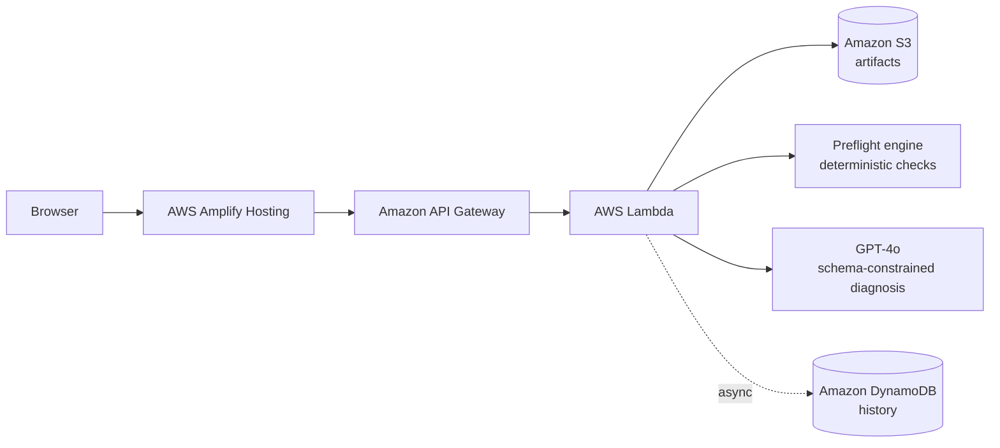

<div align="center">

# 🔍 ReproLens

### Don't ask an LLM what happened. Make it prove what happened.

**Cross-artifact investigation for ML experiments, running on a serverless AWS stack.**

[](https://main.d1dj2tq8nc6538.amplifyapp.com/)
[](https://youtu.be/yB1RJvjkTu8)
[](https://builder.aws.com/content/3JbOsrpkDMjZqut6Tzn77nWQD6T/reprolens-dont-ask-an-llm-what-happened-make-it-prove-what-happened)

Built for **First Commit** (AWS × WeMakeDevs, Bharat Builds Tour) · **Ship It** track · Team **Codorithm**

</div>

---

<!-- Add a hero screenshot or GIF of the evidence chain here:

-->

## The problem

ML training runs fail in the worst possible way: **quietly**.

A run can finish with no exception and still be badly wrong: training accuracy climbing to 99% while validation collapses. The real cause is almost never next to the symptom. It's scattered across five places:

| Artifact | What it holds |
|---|---|
| `config.yaml` | Hyperparameters, `num_classes`, model setup |
| `requirements.txt` | Dependency versions |
| `dataset_metadata.json` | Dataset shape, class count, distribution |
| `train.log` | Per-epoch metrics |
| `traceback.txt` | Exceptions, if any |

Researchers cross-reference these by hand, every time. MLflow and Weights & Biases are excellent at *capturing* this evidence, but they don't *correlate* it. Nothing tells you that your config says 8 classes, your dataset says 9, and your log parsed 10.

## What ReproLens does

Upload the five artifacts you already have. ReproLens investigates them **together** and returns a structured diagnosis:

- **Status:** `healthy`, `suspicious`, `failed`, or `insufficient_evidence`
- **Primary diagnosis** with **confidence** and **severity**
- **Competing hypotheses**, not one forced verdict
- **Evidence:** every claim cites the exact artifact, field or line, observed value, and why it matters
- **Missing information** and **recommended checks**

**Every claim is checkable.** Claim → evidence → source. Click an evidence node and the exact line from your uploaded file opens with its context highlighted. You never have to take the AI's word for it.

Built for students, researchers, and small ML teams without a platform team, who lose hours to "why did this run go wrong?"

## How it works

Two design decisions make this more than "files → LLM → paragraph":

### 1. Facts first, model second

Deterministic Python checks run **before** the LLM sees anything. A class-count mismatch between two files is either true or false, and doesn't need a model to decide. Verified findings are handed to the LLM as pre-established evidence.

Currently implemented preflight checks:

- `class_count_consistency`: config vs. dataset metadata vs. classes parsed from the training log
- `cuda_compatibility`: runtime CUDA version vs. compiled-extension CUDA version (returns `not_applicable` when the artifacts don't contain both)

### 2. Schema-constrained output, honest about uncertainty

The model's answer is constrained to a fixed JSON schema and validated in the backend. The schema requires a non-empty evidence array, supports competing hypotheses, and treats `insufficient_evidence` and `healthy` as valid outcomes. If the artifacts don't support a diagnosis, ReproLens says so instead of guessing.

## Architecture



| Service | Role |
|---|---|
| **AWS Amplify Hosting** | Hosts the frontend |
| **Amazon API Gateway** | HTTP API between browser and backend |
| **AWS Lambda** | Normalizes artifacts (safe YAML/JSON parsing, line-numbered logs for citations), runs preflight checks, calls the LLM, validates the response |
| **Amazon S3** | Stores uploaded artifacts via presigned URLs, so evidence citations resolve to the original lines |
| **Amazon DynamoDB** | Investigation history, written off the critical path so a persistence failure never blocks a diagnosis |
| **GPT-4o (OpenAI API)** | Reasoning layer. The provider and model are recorded in every response's `_meta` |

Deployed in **ap-south-1 (Mumbai)**.

## Validation: six failure classes, tested on the deployed stack

Every fixture below was run through the deployed pipeline (Amplify → API Gateway → Lambda → S3/DynamoDB → LLM), not just locally.

| # | Scenario | Preflight | Final status |
|---|---|---|---|
| 01 | Dataset/config class mismatch | contradiction | `failed` |
| 02 | CUDA incompatibility | contradiction | `failed` |
| 03 | **Silent generalization failure** (train acc 82% → 99%, val 0.48 → 0.34, no exception) | not applicable | `suspicious` |
| 04 | Missing artifact | not applicable | `insufficient_evidence` |
| 05 | Contradictory evidence (config 8, dataset 9, log 10) | contradiction | `failed` |
| 06 | **Healthy experiment** (control) | consistent | `healthy` |

Why these matter:

- **Fixture 03** is the real test. A system that only reads tracebacks would miss it. Preflight has nothing to flag, so the LLM has to correlate diverging metrics against the dataset metadata, and it returns a *suspicious* verdict rather than claiming certainty.
- **Fixture 05** shows the system isn't limited to one contradiction: it correlates three different class counts and raises dataset-version misalignment as a competing hypothesis.
- **Fixture 06** proves ReproLens doesn't manufacture problems that aren't there.

Typical end-to-end LLM latency is around **4 seconds**.

## Try it

### Live demo

👉 **https://main.d1dj2tq8nc6538.amplifyapp.com/**

Load one of the bundled fixtures, or upload your own five artifacts.

### Call the API directly

Fixtures live in [`fixtures/`](./fixtures). Replace `$API` with your deployed API Gateway URL.

```bash
# 1. Create an investigation (returns an ID and presigned S3 upload URLs)
curl -s -X POST "$API/investigations" \
  -H "Content-Type: application/json" -d '{}'

# 2. Upload each artifact to its presigned URL
curl -X PUT -T fixtures/06_healthy_experiment/config.yaml "<upload_url for config.yaml>"
# ...repeat for requirements.txt, train.log, dataset_metadata.json, traceback.txt

# 3. Run the investigation
curl -s -X POST "$API/investigations/<investigation_id>/investigate" \
  -H "Content-Type: application/json" -d '{}'
```

### Example response (healthy fixture, abridged)

```json
{
  "experiment_status": "healthy",
  "confidence": "high",
  "severity": "low",
  "evidence": [
    {
      "artifact": "dataset_metadata.json",
      "field_or_location": "num_classes",
      "observed_value": "8",
      "significance": "Matches model configuration."
    }
  ],
  "_preflight": [
    { "check": "class_count_consistency", "result": "consistent" },
    { "check": "cuda_compatibility", "result": "not_applicable" }
  ],
  "_meta": { "provider": "openai", "model_id": "gpt-4o", "llm_latency_seconds": 4.18 }
}
```

## Honest about the edges

Built in four days. We'd rather tell you the limits than have you find them:

- **Scoped to PyTorch-shaped conventions** for config and log formats.
- **Validated on synthetic fixtures**, not a real-world failure corpus.
- **No authentication layer** yet.
- **Only two deterministic checks** so far. Other signals, such as the metric divergence in Fixture 03, are surfaced by the LLM rather than verified in code.
- **The LLM can still be wrong.** ReproLens doesn't claim to eliminate hallucination. It makes a diagnosis *checkable* by grounding it in your uploaded artifacts and in verified deterministic findings.

## Roadmap

- [ ] More deterministic checks (dependency version conflicts, metric divergence, seed and determinism issues)
- [ ] Amazon Bedrock as an alternative reasoning provider
- [ ] Authentication and per-user history
- [ ] Support for more frameworks and log formats
- [ ] Validation against real-world failed runs

## Team

| | Role | Links |
|---|---|---|
| **Bala Praharsha Mannepalli** | Backend, AWS infrastructure, deployment, fixtures | [GitHub](https://github.com/balapraharsha) · [LinkedIn](https://www.linkedin.com/in/mannepalli-bala-praharsha/) |
| **Yasasswini Idimukkala** | Frontend and evidence-chain UX | [GitHub](https://github.com/yasasswini08) · [LinkedIn](https://www.linkedin.com/in/idimukkala-yasasswini) |

## Links

- 🎥 [Demo video (3 min)](https://youtu.be/yB1RJvjkTu8)
- 🌐 [Live demo](https://main.d1dj2tq8nc6538.amplifyapp.com/)
- ✍️ [Blog post on AWS Builder Center](https://builder.aws.com/content/3JbOsrpkDMjZqut6Tzn77nWQD6T/reprolens-dont-ask-an-llm-what-happened-make-it-prove-what-happened)

---

<div align="center">

*Built with AWS Amplify, Amazon API Gateway, AWS Lambda, Amazon S3, and Amazon DynamoDB.*

</div>
